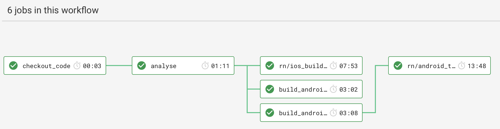

# React Native CircleCI Orb
A [CircleCI Orb](https://circleci.com/orbs/) to simplify testing your React Native app.

## Why?
Setting up CircleCI to test your React Native app correctly is hard. You need to consider using the correct machine type, installing the correct dependencies, running the correct commands, and correctly setting up caching to speed up builds. All of this is complicated and involves a lot of trial and error.

With this Orb we provide simple reusable building blocks which you can use to do the right thing easily.

## Overview
First, we recommend reading the [Using Orbs](https://circleci.com/docs/2.0/using-orbs/) guide from the CircleCI documentartion to get an overview of how to use Orbs.

This Orb provides three different categories of tools to help you build and test your React Native app on CircleCI:

* **Executors**: Machines which are configured for use with React Native.
* **Commands**: Individual tasks which you can piece together in your own jobs to perform tasks like installing dependencies, building an APK, or running Detox tests.
* **Jobs**: Groups of commands which are typically used together as a stage in a pipeline.

## Setup
Firstly, as this is a 3rd Party Orb, you need to go into your organisations settings, press on "Security", and enable usage of 3rd Party Orbs.

You will also need to ensure that you have a MacOS plan enabled if you want to build and test your iOS app, or if you want to test your Android app. Open Source projects can contact CircleCI to ask them to enable it and private projects need to select a payment plan.

## Documentation
[You can read the full documentation here](https://circleci.com/orbs/registry/orb/react-native-community/react-native).

## Android

Add this task in your <example>/app/build.gradle

```gradle
task downloadDependencies() {
  description 'Download all dependencies to the Gradle cache'
  doLast {
    configurations.findAll().each { config ->
      if (config.name.contains("minReactNative") && config.canBeResolved) {
        print config.name
        print '\n'
        config.files
      }
    }
  }
}
```

## Example

Here is a full example of how the Orb can be used in a CircleCI workflow to build and test a React Native app:

```yaml
# Orb support is from version >= 2.1
version: 2.1

# Make sure you use the latest version of the Orb!
orbs:
  rn: react-native-community/react-native@1.0.0

# Custom jobs which are not part of the Orb
jobs:
  checkout_code:
    executor: rn/linux_js
    steps:
      - checkout
      - persist_to_workspace:
          root: .
          paths: .
  analyse_js:
    executor: rn/linux_js
    steps:
      - attach_workspace:
          at: .
      - rn/yarn_install
      - run:
          name: Run ESLint
          command: yarn eslint
      - run:
          name: Flow
          command: yarn flow
      - run:
          name: Jest
          command: yarn jest

workflows:
  test:
    jobs:
      # Checkout the code and persist to the Workspace
      # Note: This is a job which is defined above and not part of the Orb
      - checkout_code

      # Analyze the Javascript using ESLint, Flow, and Jest
      # Note: This is a job which is defined above and not part of the Orb
      - analyse_js:
          requires:
            - checkout_code

      # Build the Android app in debug mode
      - rn/android_build:
          name: build_android_debug
          project_path: "android"
          build_type: debug
          requires:
            - analyse_js

      # Build and test the Android app in release mode
      # Note: We split these into seperate jobs because we can build the Android app on a Linux machine and preserve the expensive MacOS executor minutes for when it's required
      - rn/android_build:
          name: build_android_release
          project_path: "android"
          build_type: release
          requires:
            - analyse_js
      - rn/android_test:
          detox_configuration: "android.emu.release"
          requires:
            - build_android_release

      # Build and test the iOS app in release mode
      - rn/ios_build_and_test:
          project_path: "ios/Example.xcodeproj"
          device: "iPhone X"
          build_configuration: "Release"
          scheme: "Example"
          detox_configuration: "ios.sim.release"
          requires:
            - analyse_js
```

This is what the final workflow will look like:



## License
The Orb is released under the MIT license. For more information see [`LICENSE`](https://github.com/react-native-community/react-native-circleci-orb/blob/master/LICENSE).
